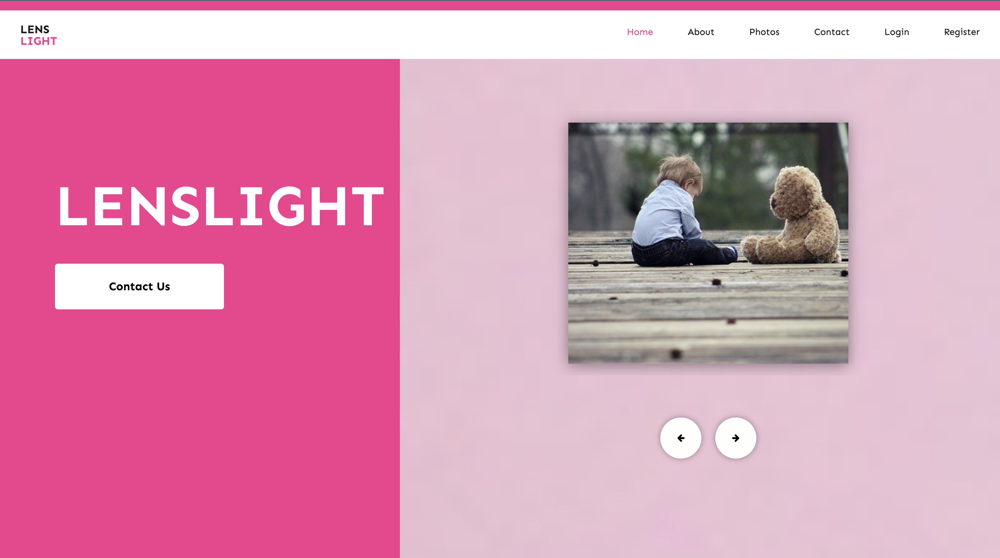

## LENSLIGHT

It is a **NodeJS** clone project that I prepared by using [Arin Yazılım](https://www.youtube.com/watch?v=JQKHO9ziXxg&list=PL-Hkw4CrSVq9rjSeiozfv0EgLUXeeS8G9)'s training videos. The template of the website used from [htmlDESIGN](https://html.design/download/lenslight-photography-website-template/).

### Libraries:
[bcrypt](https://www.npmjs.com/package/bcrypt): A library to help you hash passwords.
[cloudinary](https://www.npmjs.com/package/cloudinary): Allows you to quickly and easily integrate your application with Cloudinary.
[cookie-parser](https://www.npmjs.com/package/cookie-parser): It is used to handle and manage cookies in web applications.
[dotenv](https://www.npmjs.com/package/dotenv): Useful in web development and server-side applications to manage configuration settings and sensitive information like API keys, database credentials, and other environment-specific variables.
[ejs](https://www.npmjs.com/package/ejs): Commonly used on the server side to render web pages dynamically before sending them to the client's browser.
[express](https://www.npmjs.com/package/express): A popular and lightweight web application framework for Node.js, designed to simplify the process of building robust and scalable web applications and APIs.
[express-fileupload](https://www.npmjs.com/package/express-fileupload): Simple express middleware for uploading files.
[jsonwebtoken](https://www.npmjs.com/package/jsonwebtoken): Used for authentication and authorization purposes in web applications and APIs using JWT.
[method-override](https://www.npmjs.com/package/method-override): Used to override or change the HTTP method of an incoming request, typically POST requests, to enable the use of HTTP methods like PUT or DELETE.
[mongoose](https://www.npmjs.com/package/mongoose): Mongoose is a MongoDB database object modeling tool designed to work in an asynchronous environment.
[nodemailer](https://www.npmjs.com/package/nodemailer): Send emails from Node.js.
[validator](https://www.npmjs.com/package/validator): A library of string validators and sanitizers.
 

 ##### You can access the live version of the project from [here](https://lenslight-vbbu.onrender.com).

---

## LENSLIGHT

[Arin Yazılım](https://www.youtube.com/watch?v=JQKHO9ziXxg&list=PL-Hkw4CrSVq9rjSeiozfv0EgLUXeeS8G9)'ın eğitim videolarından faydalanarak hazırlamış olduğum **NodeJS** clone projesidir. Web sitesinin şablonu [htmlDESIGN](https://html.design/download/lenslight-photography-website-template/) sitesinden alınmıştır.

###Kullanılan Kütüphaneler:
[bcrypt](https://www.npmjs.com/package/bcrypt): Kullanıcı şifrelerini gizleyerek kaydetmek için kullanılır.
[cloudinary](https://www.npmjs.com/package/cloudinary): Görsel ve video yüklemek, depolamak, yönetmek, optimize etmek ve dağıtmak için kullanılır.
[cookie-parser](https://www.npmjs.com/package/cookie-parser): Çerezleri yüklemek ve yönetmek için kullanılır.
[dotenv](https://www.npmjs.com/package/dotenv): Bir env dosyası oluşturarak, gizlenmesi gereken bilgilerin kaydedilmesi için kullanılır.
[ejs](https://www.npmjs.com/package/ejs): Sunucu tarafında verileri HTML şablonlarına entegre etmek ve bu şablonları web tarayıcılarına sunmak için kullanılır.
[express](https://www.npmjs.com/package/express): Javascript tabanlı bir web uygulama çerçevesidir.
[express-fileupload](https://www.npmjs.com/package/express-fileupload): Sunucu tarafında dosya yükleme işlemlerini ve gelen dosyaları işlemek için kullanılırr.
[jsonwebtoken](https://www.npmjs.com/package/jsonwebtoken): JWT kullanan web uygulamalarında ve API'lerde kimlik doğrulama ve yetkilendirme amacıyla kullanılır.
[method-override](https://www.npmjs.com/package/method-override): PUT veya DELETE gibi HTTP yöntemlerinin kullanımını etkinleştirmek amacıyla, gelen bir isteğin (genellikle POST istekleri) HTTP yöntemini geçersiz kılmak veya değiştirmek için kullanılır.
[mongoose](https://www.npmjs.com/package/mongoose): MongoDB veri tabanını yönetmek için kullanılır.
[nodemailer](https://www.npmjs.com/package/nodemailer): Node.js tabanlı uygulamalarda e-posta göndermek için kullanılır.
[validator](https://www.npmjs.com/package/validator): Doğrulama işlemlerinin yapılması için kullanılır.
 

 ##### Projenin canlı haline [buradan](https://lenslight-vbbu.onrender.com) ulaşabilirsiniz.
 